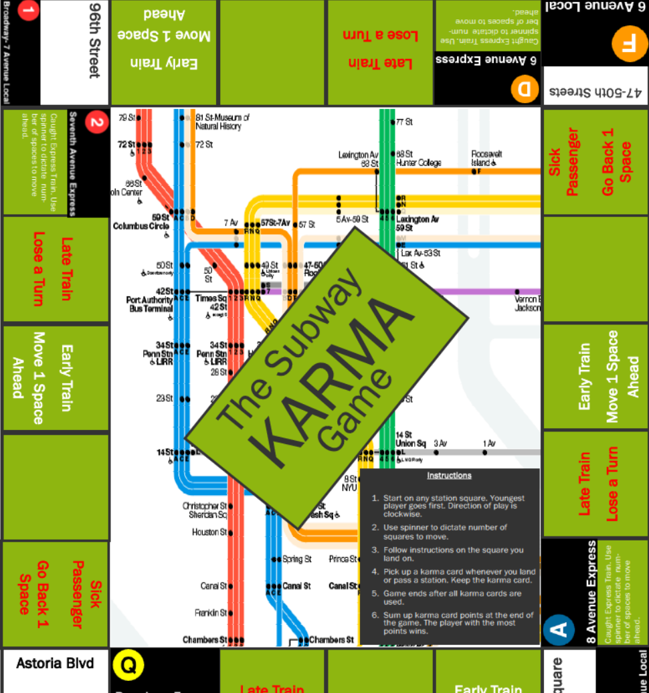

# The Subway Karma Board Game
 A board game that last as long as a NYC subway ride.

 ## Introduction

Riding the subway seems like an adventure every time I ride it. The Subway Karma board game hopes to recreate this feeling of adventure anytime. I designed this game during a game design course. I wanted to create a game that I can closely relate to at that time. I also wanted it to be simple and allow the player to customize the lenght of play by adding or removing karma cards.

## Playing

1. Start on any station square. Youngest player goes first. Direction of play is clockwise.
2. Use spinner to dictate number of squares to move.
3. Follow instructions on the square you land on
4. Pick up a karma card whenever you land or pass a station. Keep the karma card.
5. Game ends after all karma cards are used.
6. Sum up karma card points at the end of the game. 
7. The player with the most points wins.

## Customizing

Use the Karma Cards.pub file as a template to create new cards.